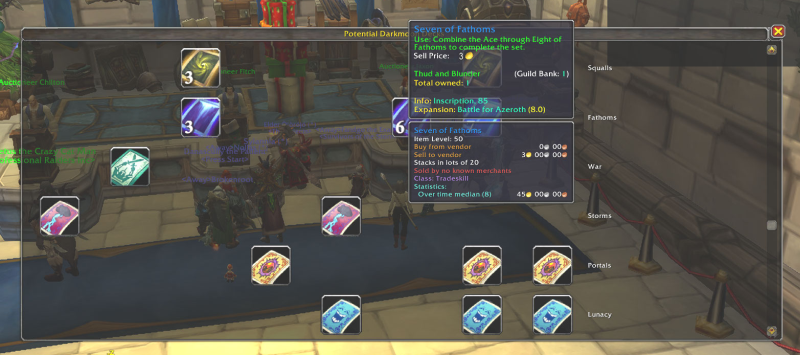

# PotentialDarkmoonDecks
Display Darkmoon cards in one's inventory that could be used to create a full deck

Using the Altoholic DataStore database, list all Darkmoon cards
accessible to the current character. This is useful to determine which
cards need to be acquired (purchased or made) to complete a deck.

All cards found on the current faction in connected realms (via
Altoholic's database) are listed. You'll need to visit all the places
where cards might be stored (eg. character banks and guild vaults) to
populate the database. Shared account data is included in the search.

## Usage

Type /pddgui to display a window of available cards. Mouse over a card
to view its tooltip, revealing which alt has that card.

You can also type /pdd to display the available cards in the chat
window in a compact table. (This lacks the tooltips, though.)

## Prerequisite

This addon requires the installation of
[Altoholic](https://www.curseforge.com/wow/addons/altoholic) to
acquire the data.
